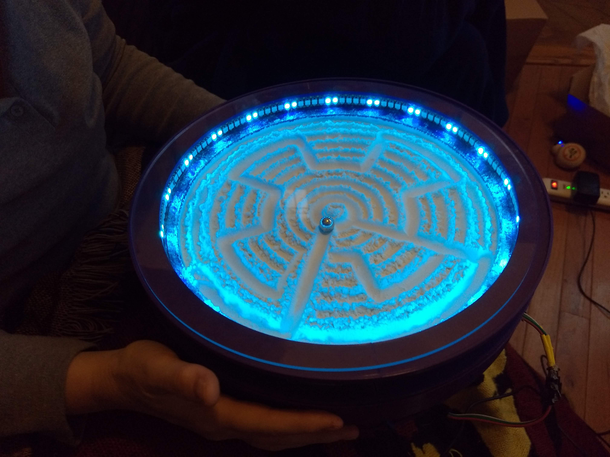

# SandThing
Arduino powered, 3D printed, sand art table. 

## Intro

This is a project to create a device that can create sand drawings on a flat surface, using 3D printed parts, powered by an Arduino.

The concept is fairly simple: a cicular plate holds a thin layer of sand and a metal ball.  Underneath the ball is a magnet chich can be moved via stepper motors that are controled by an Arduino board.  The desired affect is to drag the ball across the sand, via the magnet beneath, creating a picture in the sand.

## 3D Printed Parts

The source code for these 3D printed parts can be found in the fusions_files folder.

Here's a rendering of the design from 30 July, 2021:

</img>

So far, these parts include a cage for the heat sink, contains for the stepper motors, a cage for the arm-loaded fan, as well as the arm assembly itself, which allows the magnet to move both in the radial and azimuthal directions.

## Electronics

This project uses:
   * Arduino 
   * Motor chips
   * 2 Stepper Motors
   * Fan
   * Heat sink
   

## Source Code

The code can be found in the src directory.  

## Gallery

Here's how it looked at the start, 30 July, 2021:

</img>

It took some experimentation to see what kind of 'sand' worked best:

